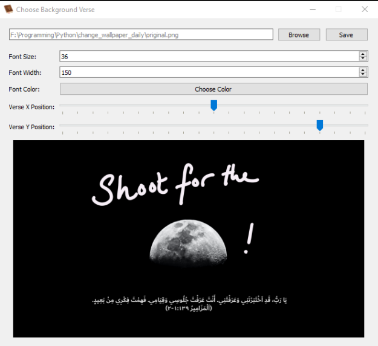
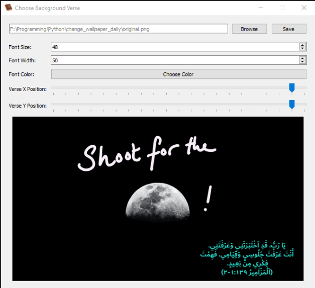
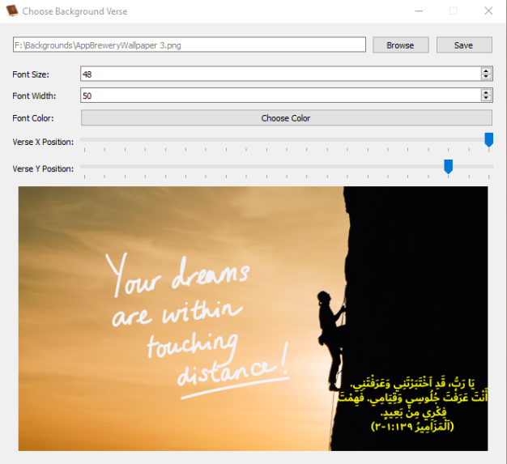
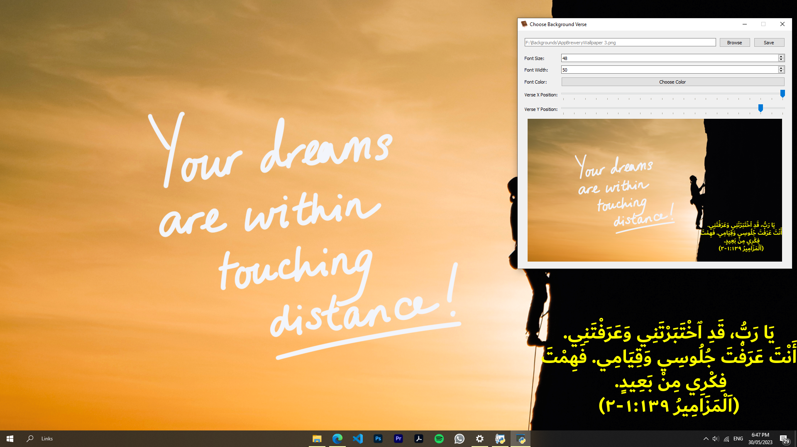
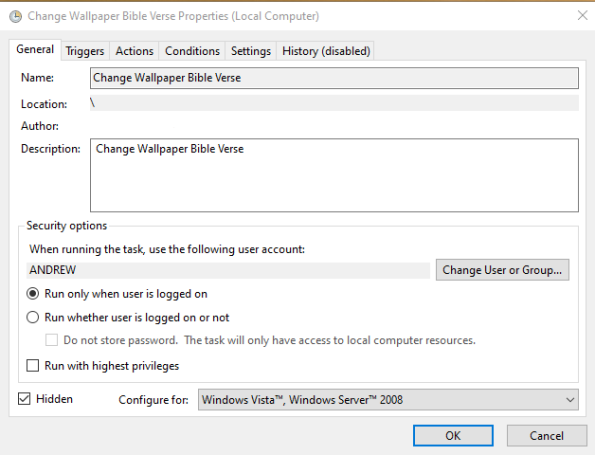

# Daily Bible Verse Wallpaper

This application generates a customized wallpaper image every day with a bible verse from dailyverses.net written over a background image of your choice. The wallpaper is automatically set as your desktop background at a scheduled time.

## Requirements
- Python 3
- PyQt5 Lib
- PIL Lib
- BeautifulSoup Lib
- win32com Lib
- json Lib
- requests Lib

## Usage

1. Run `change_wallpaper_gui.py` to start the application
2. Select a background image and set the font, size, color and text position
3. Click "Save" to:
   - Create a scheduled task in Windows Task Scheduler to run the `change_wallpaper_daily.py` daily
   - Save your settings to `settings.json`
   - Generate the wallpaper image 
4. The application will show a preview of the wallpaper 
5. Any unsaved changes will prompt you to save or discard before exiting
6. Upon exit, the temporary wallpaper image is deleted

## Screenshots
- The GUI When it first opens by default

- The default image but with some edits in size, position and color

- When another image is selected by the "Browse" button

- My bacground changed when "Save" is pressed

- A task is successfully created in my Task Scheduler

## Features

- Browse and select a custom background image
- Configure font settings, size, width, color and verse position  
- Live preview of updates  
- Save settings to automatically generate the wallpaper daily 
- Prompt to save unsaved changes before closing
- Uses Windows Task Scheduler to run script at scheduled time

## Credits

- [Arabic bible text from dailyverses.net](https://dailyverses.net/ar)
